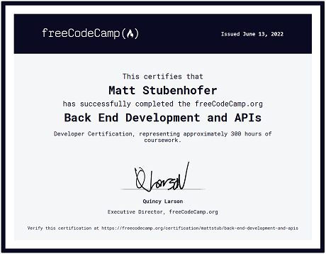

# freeCodeCamp - Back End Certification

A collection of the challenges and projects created for the back end curriculum. This directory is my current focus as of 5/31/2022

### Directory
- Courses
  - [managing packages with NPM](boilerplate-npm)
  - [basic node & express](boilerplate-node-express)
  - [mongodb & mongoose](boilerplate-mongo-mongoose)
- Back End Development & API Projects
  - [timestamp microservice]() - *placeholder*
  - [request header parser microservice]() - *placeholder*
  - [url shortener microservice]() - *placeholder*
  - [exercise tracker]() - *placeholder*
  - [file metadata microservice]() - *placeholder*
