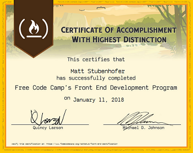

# freeCodeCamp - Front End Certification
*Legacy*

A collection of the challenges and projects created for the *Legacy* front end curriculum as well as the sandbox I utilized in later challenges to work with something other than built in browser IDE

### Directory
- Snippets
  - [code sandbox](snippets)
- Basic
  - [tribute](basic/tribute) | [live](http://www.mattstub.com/edu/fcc-frontend/basic/tribute)
  - [portfolio](http://www.mattstub.com)
- Intermediate
  - [lyric machine](intermediate/lyricgenerator) | [live](http://www.mattstub.com/edu/fcc-frontend/intermediate/lyricgenerator)
  - [local weather app](intermediate/localweather) | [live](http://www.mattstub.com/edu/fcc-frontend/intermediate/localweather)
  - [wikipedia viewer](intermediate/wikipedia) | [live](http://www.mattstub.com/edu/fcc-frontend/intermediate/wikipedia)
  - [twitch.tv](intermediate/twitch) | [live](http://www.mattstub.com/edu/fcc-frontend/intermediate/twitch)
- Advanced
  - [javascript calculator](advanced/calculator) | [live](http://www.mattstub.com/edu/fcc-frontend/advanced/calculator)
  - [pomodoro clock](advanced/pomodoro) | [live](http://www.mattstub.com/edu/fcc-frontend/advanced/pomodoro)
  - [tic-tac-toe](advanced/tictactoe) | [live](http://www.mattstub.com/edu/fcc-frontend/advanced/tictactoe)
  - [simon game](advanced/simon) | [live](http://www.mattstub.com/edu/fcc-frontend/advanced/simon)
