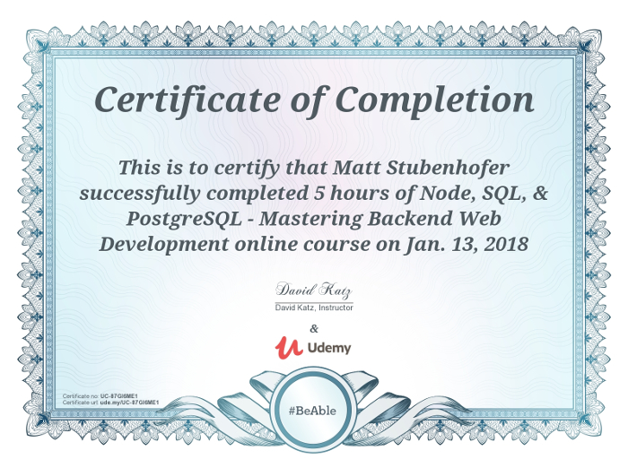

# Udemy's Node, SQL, & PostgreSQl - Mastering Backend Web Development

A collection of snippets and programs written during David Katz's course available on [Udemy](https://www.udemy.com/node-postgresql).

### Directory
- [fortunes-api](fortunes-api): an api with endpoints for random fortunes
- [monsters-api](monsters-api): an api with endpoints for random monsters

### Dependencies
- NodeJS
- NPM
- [PostgreSQL](psql/postgresql-installation.md): For help installing, please follow the link
